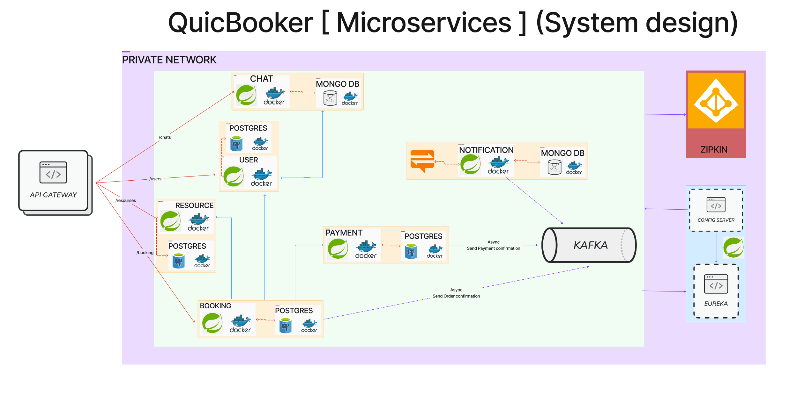

# Booking/Reservation Service 

## You can read about the project in the package /about_the_project.

### A quick explanation of the path taken.
Originally initiated as a real-time chat application similar to Telegram, utilizing WebSockets, microservices and related technologies, the project pivoted to become a booking service. This decision was driven by the desire for more complexity and profitability. The booking service is now designed with a microservices architecture, allowing for enhanced scalability, flexibility, and the incorporation of various functionalities.

